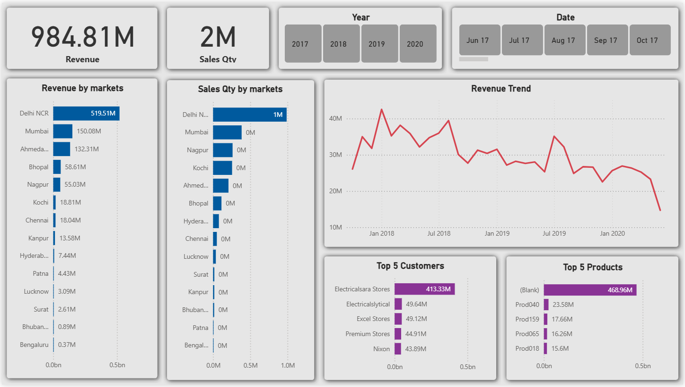

# Four Year Sales & Revenue Insights

A comprehensive deep-dive into sales performance, market contribution, customer value, and product trends, built to identify key growth drivers and areas for improvement for a hypothetical B2B distributor.

---

## Technology Stack & Pipeline

This project demonstrates a full-stack data pipeline workflow, from raw data source management to final business visualization.

| Component | Tool / File | Description |
| :--- | :--- | :--- |
| **Data Source** | **MySQL** | The database engine used for data storage, ensuring scalability and data integrity. |
| **Data Dump** | `sales_data_dump.sql` | Contains the complete schemas and raw transactional data (2017-2020) for full project replication. |
| **Visualization** | **Power BI** | Tool used for data modeling, DAX/calculations, and interactive dashboard design. |
| **Source File** | `Sales_Analysis_Dashboard.[pbix/twbx]` | The complete source file for reviewing the data model and logic. |

---

## Key Business Insights

The analysis focuses on identifying high-value markets, managing concentration risks, and tracking historical performance, driving actionable business decisions.

1.  **High Concentration Risk (Customer):** The dashboard clearly highlights a critical dependency on the top customer, **Electricalsara Stores,** who alone contributed **$413.33M** in revenue. This high concentration poses a significant business risk if that customer is lost.
2.  **Market Dominance:** **Delhi NCR ($519.51M)** is the primary revenue engine. This requires a balanced strategy to maintain market share while exploring opportunities for growth in secondary markets.
3.  **Revenue Volatility:** The time-series trend shows a sharp, concerning decline in sales volume during the final quarter of **2020 (around October)**, indicating a need for urgent operational investigation.

---

## Dashboard Preview

The final visual output is included below for quick review. Click to view the full resolution image:



---

## Project Setup & Replication

The raw data is provided as an executable SQL dump file, allowing any user to instantly recreate the entire source database locally.

1.  **Prerequisites:** Install a MySQL or similar SQL Server instance.
2.  **Load Data:** Execute the `sales_data_dump.sql` file using your preferred SQL client (e.g., MySQL Workbench, DBeaver) to create the necessary tables and populate the data.

```sql
-- Example command to import the data via terminal
mysql -u [your_user] -p [database_name] < sales_data_dump.sql
